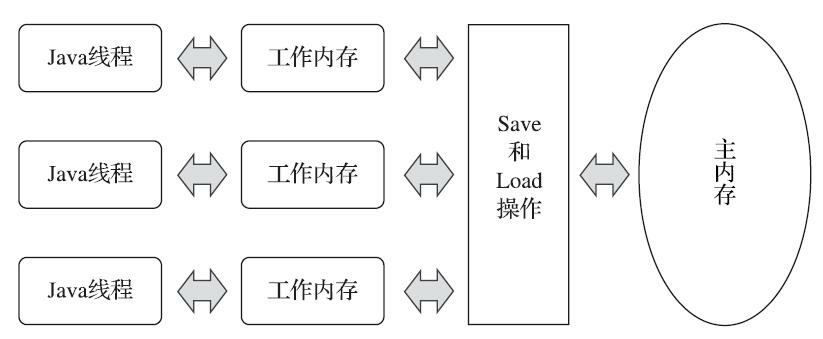

## 高效并发

### 1.硬件的效率一致性

​	在多线程处理问题和提高计算机处理效率之间的因果关系看似是理所当然的，但是其中还存在一定差距。计算机在处理问题时不止是在计算，还存在着大量的内存交互IO操作，而这两个之间存在着几个数量级之间的差距，所以现代计算机系统为了弥补这种差距，都设计了多级高速缓存。而这又引入了一个新的问题，内存一致性。
​	每个处理器都有自己的高速缓存，而它们又共享同一主内存。下图是计算机的内存模型


​	除了高速缓存外，为了使处理器内部的运算单位被充分利用，处理器会对输入代码进行乱序执行优化，然后再将乱序执行的结果重组，保证与顺序执行的结果一致性。因此如果存在一个计算任务依赖另外一个计算任务的中间结果，其顺序性不能依靠代码的先后顺序保障。

### 2.Java内存模型

#### 1.内存间交互

​	Java内存模型规定了所有的变量都存储再主内存中，每条线程都有自己的工作内存，保存了该线程使用的变量的主内存副本，线程对变量的所有操作都必须在工作内存中完成。不同线程也无法直接访问对方工作内存中的变量，线程间变量值的传递均需通过主内存完成。



​	·lock（锁定） ： 作用于主内存的变量， 它把一个变量标识为一条线程独占的状态。
​	·unlock（解锁） ： 作用于主内存的变量， 它把一个处于锁定状态的变量释放出来， 释放后的变量
才可以被其他线程锁定。
​	·read（读取） ： 作用于主内存的变量， 它把一个变量的值从主内存传输到线程的工作内存中， 以
​	便随后的load动作使用。
​	·load（载入） ： 作用于工作内存的变量， 它把read操作从主内存中得到的变量值放入工作内存的
变量副本中。
​	·use（使用） ： 作用于工作内存的变量， 它把工作内存中一个变量的值传递给执行引擎， 每当虚
拟机遇到一个需要使用变量的值的字节码指令时将会执行这个操作。
​	·assign（赋值） ： 作用于工作内存的变量， 它把一个从执行引擎接收的值赋给工作内存的变量，
每当虚拟机遇到一个给变量赋值的字节码指令时执行这个操作。
​	·store（存储） ： 作用于工作内存的变量， 它把工作内存中一个变量的值传送到主内存中， 以便随
后的write操作使用。
​	·write（写入） ： 作用于主内存的变量， 它把store操作从工作内存中得到的变量的值放入主内存的
变量中  	

​	现代设计将Java内存模型的操作简化为read、 write、 lock和unlock四种， 但这只是语言描述上的等价化简， Java内存模型的基础设计并未改变 。

#### 2.对于Volatile型变量的特殊规则

​	关键字volatile是Java提供的最轻量级的同步机制，当一个变量被定义为了volatile时，它将具备两项特性：第一项时保证次变量对所有线程的可见性。这里的“可见性”是指当一条线程修改了这个变量的值，新值对于其他线程来说时立即可以得知的。而普通变量的值在线程中传递均需通过主内存完成，线程A修改值，写入主内存。线程B等待A写入完成，在进行读取，此时新值才对B可见。

​	关于volatile涉及的并发问题，先看代码

```java
public class VolatileTest {
    public static volatile AtomicInteger number =new AtomicInteger(0);
//    public static volatile int number=0;
    public static void increase(){
        number.getAndIncrement();
//        number++;
    }
    public static void main(String[] args) throws InterruptedException {
        Thread[] threads = new Thread[20];
        for(int i=0;i<20;i++){
            threads[i] = new Thread(new Runnable() {
                public void run() {
                   for(int i=0;i<10000;i++){
                       increase();
                   }
                }
            });
            threads[i].start();
        }
        for(int i=0;i<20;i++){
            threads[i].join();
        }
//        while(Thread.activeCount()>1) System.out.println(Thread.activeCount());
//		  原文使用的是这个方法，但是IDEA自动存在RMI线程，导致不满足条件，换成join
        System.out.println(number);
    }
}
```

​	一开始使用int num和num++，会发现最后的结果与预期的20000相差很大。那是因为num++是不是原子性操作，从字节码层面来说，总共有四步。在第一步取得值时是正确的，但是后续可能其他线程已经改变了race的值，而当前线程就会把一个比较小的值同步会主内存了。

```tex
0: getstatic #13; //Field race:I  获取值并压入操作数栈
3: iconst_1     将数字1压入操作数栈
4: iadd
5: putstatic #13; //Field race:I
8: return
```

​	这里使用字节码仍不严谨，因为这里的一条指令转化为机器码指令时有可能是多条，但在此处足以说明问题。后续改为AtomicInteger消除这个问题。

​	volatile还可以防止指令重排。

### 引用——《深入理解JVM第三版》周志明