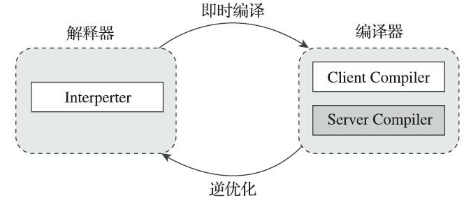
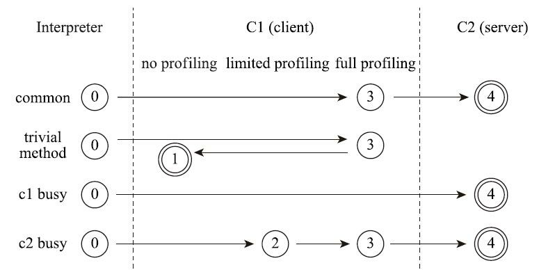
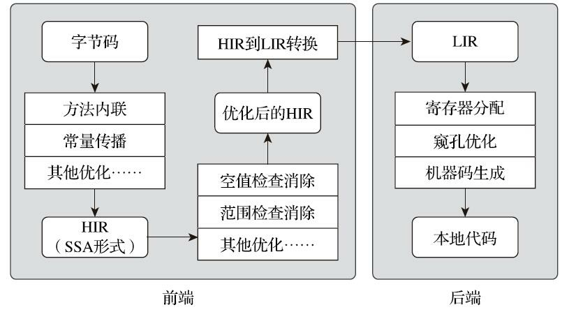

### 1.即时编译器

​	Java程序最初都是通过解释器Interpreter进行解释执行的，当虚拟机发现某个方法或代码块运行特别频繁，就会把这些代码认定为热点代码，为了提高热点代码的执行效率，在运行时，虚拟机会把这些代码编译本本地机器码，然后进行各种优化。运行时完成这个任务的后端编译器被称为即时编译器。

#### 1.解释器与编译器

​	主流的Java虚拟机如HotSpot等都是同时包含解释器与编译器。当程序需要快速启动和执行时，解释器可以先发挥作用，省去编译的时间，立即运行。当程序启动后，编译器逐渐发挥作用，将热点代码编译成本地机器码，减少解释器的中间损耗，提高执行效率。



​	HotSpot虚拟机中内置了三个即时编译器，其中有两个存在已久。分别是Client Complier客户端编译器和Server Complier服务端编译器，简称为C1，C2。还有一个Graal编译器，采取了更加激进的优化策略。
​	虚拟机默认采用Mixed Mode，同时使用C1，C2.

```
C:\Users\lord2>java -version
java version "17.0.10" 2024-01-16 LTS
Java(TM) SE Runtime Environment (build 17.0.10+11-LTS-240)
Java HotSpot(TM) 64-Bit Server VM (build 17.0.10+11-LTS-240, mixed mode, sharing)

C:\Users\lord2>java -Xint -version
java version "17.0.10" 2024-01-16 LTS
Java(TM) SE Runtime Environment (build 17.0.10+11-LTS-240)
Java HotSpot(TM) 64-Bit Server VM (build 17.0.10+11-LTS-240, interpreted mode, sharing)

C:\Users\lord2>java -Xcomp -version
java version "17.0.10" 2024-01-16 LTS
Java(TM) SE Runtime Environment (build 17.0.10+11-LTS-240)
Java HotSpot(TM) 64-Bit Server VM (build 17.0.10+11-LTS-240, compiled mode, sharing)
```

#### 2.分层编译

​	第0层：程序纯解释执行，解释器不开启性能监控功能Profiling
​	第一层：使用客户端编译器将字节码转为本地代码运行，进行简单可靠优化，不开启Profiling
​	第二层：仍使用客户端编译器执行，仅开启方法及回边次数统计等有限性能监控功能
​	第三层：仍使用客户端编译器执行，开启全部性能监控，额外信息如分支跳转，虚方法调用版本等
​	第四层：使用服务器端编译器将字节码编译为本地代码，相比客户端，服务器端编译器会启用更多编译时长更长的优化，还会根据性能监控信息进行一些不可靠的激进优化。

​	以上层次不是固定排序的。各虚拟机，版本，参数不同都会不同。



### 2.编译对象与触发条件

​	在本章中提到的热点代码主要分为两类：被多次调用的方法，被多次执行的循环体。
​	主要有两种探测热点代码的方法：

#### 	1.基于采样的热点探测

​	虚拟机周期性的检查各个线程的调用栈顶，如果发现某些方法经常出现在栈顶，那这个方法就是热点方法。好处时实现简单高效，还可以很容易的获取方法调用关系。缺点时很难精确的确认一个方法的热点，容易收到线程阻塞或别的外界因素影响。

#### 	2.基于计数器的热点探测

​	HotSpot采用的就是这种。它为每个方法甚至是代码块建立计数器，统计方法的执行次数。如果执行次数超过阈值，则认定为热点方法。这种方法实现起来麻烦一些，需要维护每一个方法的计数器，且不能直接获取到方法的调用关系，但结果精确严谨。
​	HotSpot为每个方法准备了两类计数器：方法调用计数器(Invocation Counter)，回边计数器(Back Edge Counter，回边是指在循环边界往回跳转)。
​	需要注意的是在默认情况下方法计数器调用的不是方法被调用的绝对次数，而是一个相对的执行频率，即一段时间内被调用的次数。当超过一定时间后，这个方法还不足以被提交给编译器编译，则该方法的调用计数器减少一半。这个过程称为计数器的热度衰减，它实在虚拟机在进行垃圾回收是顺带进行的，可使用-XX:YesCounterDecay关闭热度衰减，让其统计绝对方法。也可用-XX:CounerHalfLifeTime设置半衰期时间，单位为秒。
​	与方法计数器不同，回边计数器没有热度衰减，当计数器溢出时，它还会把方法计数器也调整为溢出，这样下次再进入该方法时会执行标准编译过程。

### 3.编译过程

​	对于客户端编译器来说，是一个简单的三段式编译器。

​	第一阶段，将字节码构造成一种高级中间代码（HIR，High-Level Intermediate Representation，即与机器指令无关的中间表示)。HIR使用静态单分配（SSA，Static Single Assignment）的形式代表代码值。在此之前编译器会在字节码上完成一部分基础优化，如方法内联，常量传播等。
​	第二阶段，从HIR中产生低级中间代码（LIR,Low-Level Intermediate Representation)，在此之前会在HIR上完成一些优化如空值检查消除，范围检查消除等。
​	最后使用线性扫描算法，再LIR上分配寄存器，然后产生机器代码。



​	而服务端编译器则非常复杂。