## 类文件结构

```java
public class TestClass {
	private int m;
	public int inc() {
	return m + 1;}
}
```

#### 1.魔数

​	每个Class文件的头四个字节被称为Magic Number，用来判断一个文件是否是能被虚拟机接收的Class文件，下图是使用ImHex观察到的，后面也都是如此。

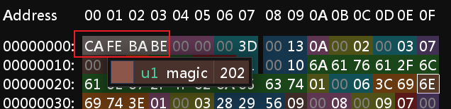

#### 2.版本号

​	紧接着后四位是Class文件的版本号，第五和第六表示次版本号MinorVersion，第七和第八表示主版本号Major Version。高版本JDK可以向下兼容以前版本的Class文件，但不能运行之后的版本，所以虚拟机拒绝执行超过其版本号的Class文件。

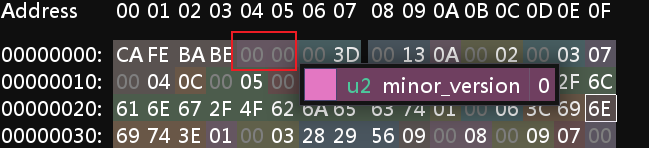

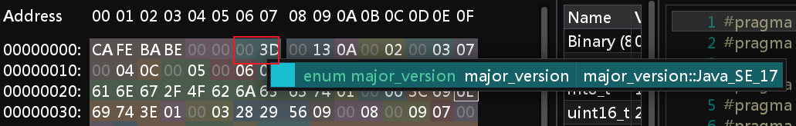

​	可以看到笔者使用的是jdk17进行的编译

#### 3.常量池

​	接着后四位表示常量池中容量计数器，要注意的是它是从一开始计数

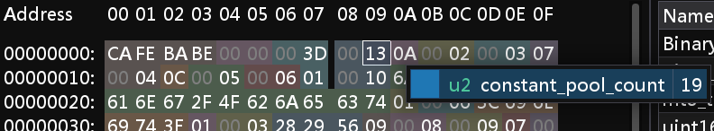

​	这里的偏移量是转为十进制后是19，代表常量池中有19个常量。其中主要存放两大类常量：字面量(Literal)和符号引用(Symbolic Reference)。字面量像是文本字符串，被声明有final的常量值。而符号引用就有很多了。Package包名，Full Qualified Name类和接口的全限定名，Descriptor字段，方法名称和描述符。Method Handle，Method Type，Invoke Dynamic方法句柄和类型。Dynamically-Computed Call Site，Dynamically-Computed Constant动态调用点和动态常量。

​	下图是常量池标志对应表，可以看到总共有17中常量类型。

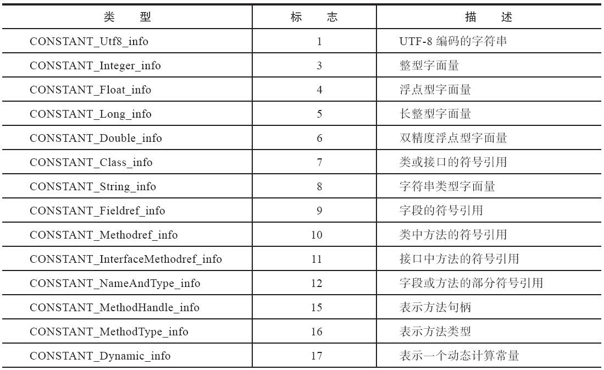

​	下面是使用javap名称输出常量表

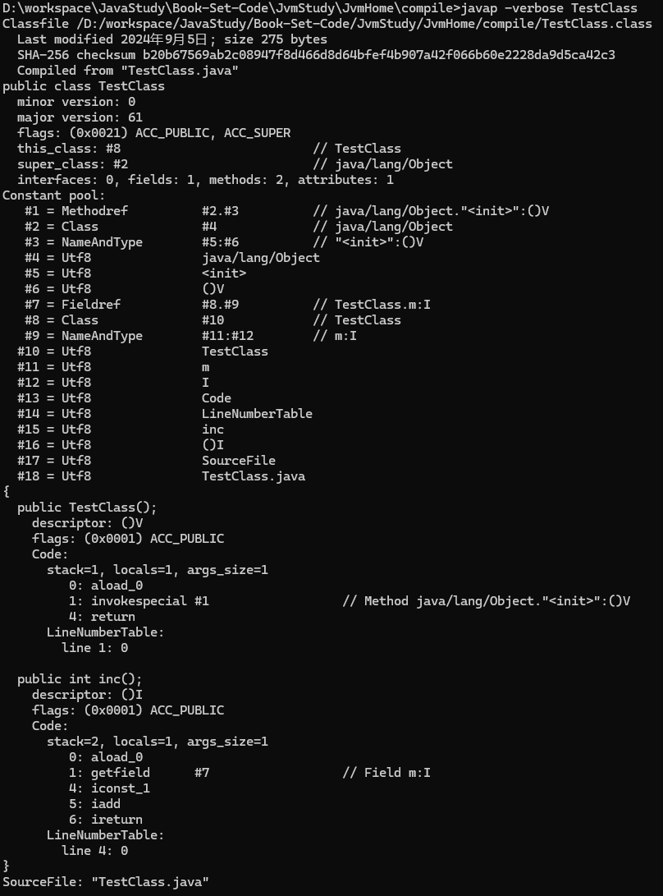

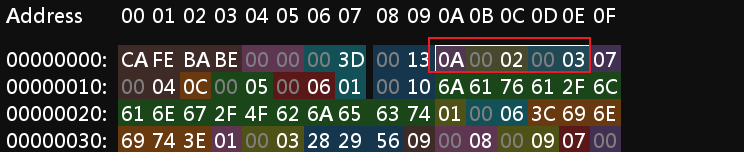	

​	这里分析一下它的开始和结尾

```yaml
Methodrdf  <—— :tag 10	表示方法引用
	:class_index 2 指向常量池中的第 2 项。这个索引指向了一个 Class 常量表项，它标识了这个方法所属的类或接口
	:name_and_type_index 3  指向常量池中的某个 NameAndType 项。这个索引标识了该方法的名称和签名（即方法参数和返回值的类型）
```

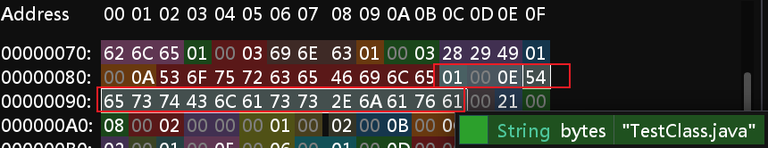

​	CONSTANT_Utf8_info型常量的结构  

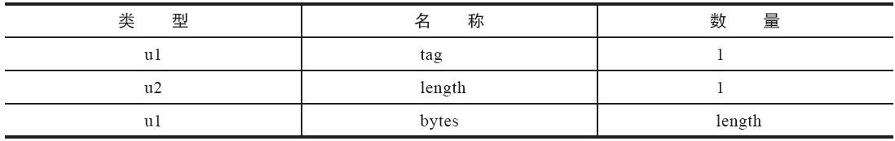

```
Utf-8 <—— :tag 1  表明它是一个字符串
	：length 14 
	:bytes "TestClass.java"
```

#### 4.访问标志

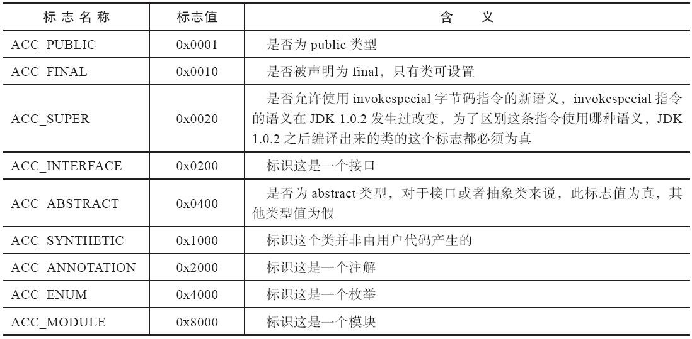

​	在常量池之后就是2个字节代表访问标志 access_flags。例C拉萨市是类还是接口；是否为public，abstract；如果是类是否被声明为final....

```
ACC_PUBLIC,ACC_FINAL,ACC_SUPER,ACC_INTERFACE,ACC_ASBTRACT,ACC_SYNTHETIC,ACC_ANNOTATION,ACC_ENUM,ACC_MODULE
```

​	0x0021其中2表示ACC_SUPER，1表示ACC_PUBLIC

#### 5.类索引，父类索引，接口索引集合

​	this_calss和super_class都是一个u2类型的数据，interfaces是一组u2类型数据集合，由这三项确定该类的继承关系。

#### 6.字段表集合

​	一个字段的信息包括作用域修饰符-Public,Private,Protect，是否static，可变性final，并发可见性Volatile，可序列化transient，类型-基本类型，数组，对象，名称。
​	修饰符和上面介绍类的时候雷同，不讲了。讲一下name_index—字段的简单名称和descriptor_index—描述符。
简单名称是区别于全限定名这个概念的，在javap中可以看到我没有将TestClass放入任何包中，所以全限定名就是类名。
而name_index就是inc和m。
​	descriptor_index存在标识符B-byte，C-char，D-double，F-float，I-int，J-long，S，Z-boolean,V-void,L-对象
对于数组，每一维度使用一个前置 [ 字符描述，如一个二位数组 java.lang.String[][]被记录为[[Ljava/lang/String;
一个 int[] 为 [I。
​	这里就是之前上大学看到反编译代码的时候根本看不懂的东西，终于懂了哈哈哈

#### 7.方法表集合

略

#### 8.属性表集合

多到可以再列一章略。

#### 9.Code属性

​	可以看到javap最后放出了Code内容，这里包含的就是整个class文件的核心，你的方法内容被编译在这里。这里我的类只定义了一个方法，却有两个方法被编译了出来，这是为什么呢？又印证了java会给每一个类隐式定义一个构造方法。
​	而我的方法明明没有参数，为什么又有Arg_size=1呢？
​	Java语言的潜规则：在任实例方法中，都可以通过this访问到方法所属的对象——哈哈哈哈，我猜大家平时在写代码的时候在方法内引用当前类的属性都不会显式的把this.给写出来，而是直接拿属性了。
​	我们这里将方法声明为static

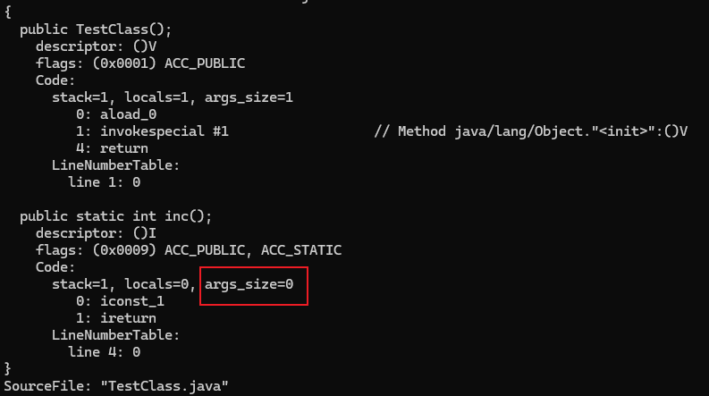
可以看到args_size变为了0。
	其中还有max_stack——操作数栈的最大深度，max_locals——局部变量表所需的存储空间，单位是Slot，code_lenght——字节码长度，cde——具体的字节流

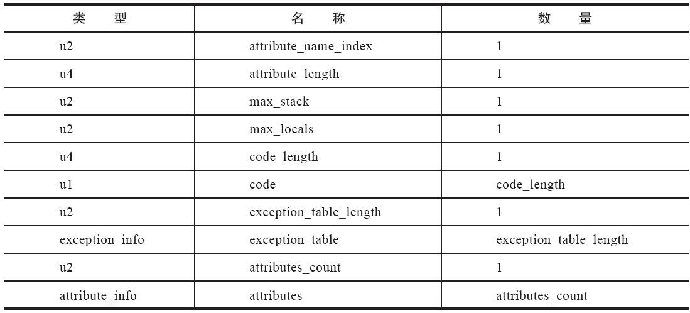

#### 10.运行时注解相关属性

Annotations略

