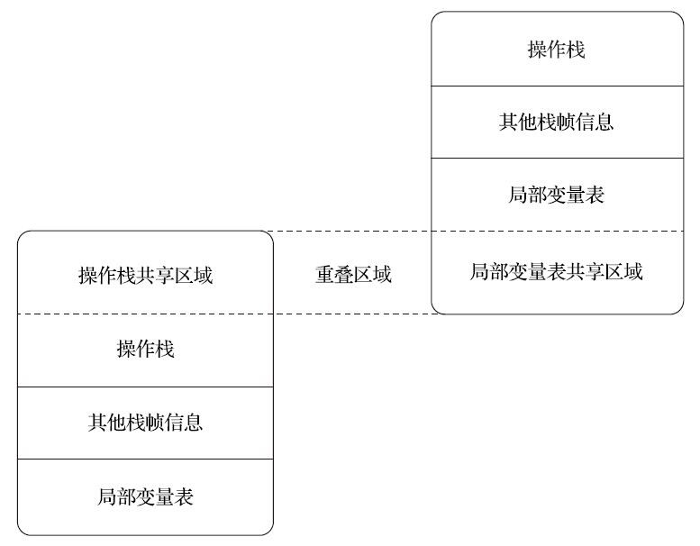

## 虚拟机字节码执行引擎

#### 1.概述

​	虚拟机是相对物理机的概念，物理机受制于处理器，缓存，指令集，操作系统的限制。而虚拟机则是由软件自行实现的，可以执行那些不被硬件直接支持的指令集格式。所有Java虚拟机的执行引擎输入输出都是一致的：输入字节码二进制
流，输出执行结果

#### 2.运行时栈帧结构

​	局部变量表，老朋友了，以一个变量槽为基础单位。操作数栈，动态连接，方法返回地址。
​	一个变量槽可以存放32位以内的数据类型：boolean，byte，int，char，short，float，reference，returnAddress（现在几乎已经不用了）。对于64位：long，double，高位对齐方式，分割为两个32位读写。
​	通过索引定位的方式使用局部变量表，访问的是32位数据类型变量，索引N代表使用第N个变量槽，64位的话会同时使用N，N+1。虚拟机不允许任何方式单独访问其中一个。当一个方法被调用时，Java虚拟机会使用局部变量表来完成参数值到参数变量列表的传递过程，~~即形参到实参。~~ 实参到形参。
​	需要注意的是局部变量表中的变量槽是可以重用的。
下面是我和chatGpt一段有趣的对话。

##### 您说：

我在研究java的局部变量表，下面是两段代码 使用verbose:gc可以看到他们的gc收集情况不同，详细解释一下

###### ChatGPT 说：

ChatGPT

记忆已更新

在这两段代码中，`byte[] placeholder` 的作用域不同，导致了两者在垃圾回收（GC）行为上的差异。

1. **第一段代码：**

   ```java
   java复制代码public static void main(String[] args) {
       byte[] placeholder = new byte[64 * 1024 * 1024];
       System.gc();
   }
   ```

   在这段代码中，`placeholder` 的作用域是整个 `main` 方法。在调用 `System.gc()` 时，`placeholder` 仍然在作用域内，即它仍然是一个可达的对象。虽然 `System.gc()` 会触发垃圾回收器尝试进行 GC，但因为 `placeholder` 仍在作用域内，垃圾回收器不会回收该对象，因此该对象仍然会占用内存。

2. **第二段代码：**

   ```java
   java复制代码public static void main(String[] args) {
       {
           byte[] placeholder = new byte[64 * 1024 * 1024];
       }
       int a = 0;
       System.gc();
   }
   ```

   在这段代码中，`placeholder` 的作用域仅限于大括号 `{}` 内。一旦执行完这段代码块，`placeholder` 的作用域结束，它就变成了不可达对象。在调用 `System.gc()` 时，虽然我们没有显式地将 `placeholder` 设为 `null`，但由于它已经超出了作用域，垃圾回收器会将其视为不可达对象并尝试回收它的内存。因此，这个对象有可能在 GC 时被回收。

**总结：**

- 第一段代码中，`placeholder` 在 GC 时仍然处于作用域内，无法被回收。
- 第二段代码中，`placeholder` 超出了作用域，GC 会将其标记为不可达，并有可能回收。

`verbose:gc` 的输出会反映这个差异：在第二段代码中，内存的释放和 GC 触发可能更加明显。

##### 您说：

不是这个原因，第二段代码如果不加int a=0，那么这两个的gc结果都是一样的。

###### ChatGPT 说：

ChatGPT

确实，`int a = 0;` 是影响垃圾回收行为的关键。Java 虚拟机在垃圾回收过程中，局部变量的作用范围和编译器优化都会对对象是否可达产生影响。

我们来更详细地分析为什么在第二段代码中加入 `int a = 0;` 会影响垃圾回收：

1. **代码执行时的局部变量表：** Java 的局部变量表用于保存方法中的局部变量。对于第一段代码，`placeholder` 在调用 `System.gc()` 时仍然占用着局部变量表中的一个槽位（slot）。即使它超出了局部作用域，只要编译器没有复用这个槽位，GC 仍然可能认为 `placeholder` 是可达的，因此不会回收它。
2. **第二段代码不带 `int a = 0;` 的情况：** 当不加 `int a = 0;` 时，`placeholder` 超出作用域后，局部变量表中的槽位仍然可能未被复用，因此在 GC 扫描时，`placeholder` 仍然被认为是可达的，导致这两个代码段的 GC 行为一致，内存不会被回收。
3. **加上 `int a = 0;` 的情况：** 当我们在第二段代码中加入 `int a = 0;` 时，局部变量表的槽位可能被复用，`a` 会占据原本属于 `placeholder` 的槽位。这意味着在调用 `System.gc()` 时，`placeholder` 的引用已经被覆盖，它不再是可达的对象，从而允许 GC 回收其占用的内存。

**解释：** 在 Java 中，局部变量的可达性不仅取决于其作用域，还取决于局部变量表的槽位是否被复用。如果某个变量仍然在局部变量表中占有一个槽位，即使它超出了作用域，GC 也可能不会回收它。如果该槽位被新的变量覆盖，则这个旧对象将被视为不可达，允许 GC 回收。

因此，`int a = 0;` 的存在导致了局部变量表中对 `placeholder` 的引用被清除，从而触发垃圾回收。

##### 您说：

在我没有告诉你int a=0这是一条关键代码之前，你是否知道后续的内容只是不想说出来，还是说你一开始只考虑到了作用域的条件

###### ChatGPT 说：

ChatGPT

在最初的回答中，我主要是基于变量的**作用域**来解释 GC 的行为，确实没有立即考虑到局部变量表的**槽位复用**这一点。这是因为变量作用域通常是影响可达性的重要因素之一，而槽位复用的影响往往不如作用域那么直观。

当你提到 `int a = 0;` 这个关键点后，我意识到应该进一步考虑局部变量表的槽位管理，以及 JVM 如何在垃圾回收时处理局部变量的引用问题。因此，后续的解释更多地涉及到了 JVM 局部变量表的机制。

简而言之，最初的回答是以作用域为主的解释，没有深入考虑到局部变量表槽位复用的情况。不过，当你指出了 `int a = 0;` 这条线索后，我才进一步拓展到这个更细节的方面。

哈哈哈，chatGpt真好玩~~~~

在研究时还发现了一个有意思的现象

```java
public static void main(String[] args) {
        for(int i=0;i<100;i++){
            {
                byte[] placeHolder=new byte[64*1024*1024];
            }
            int a=0;
            System.gc();
        }
    }
```

局部变量槽的复用还会影响JVM对于堆内存的大小分配，在没有int a=0；时，G1给分配的内存时256MB
[0.802s][info][gc] GC(294) Pause Full (System.gc()) 136M->68M(256M)
当加入这条语句时
[0.873s][info][gc] GC(293) Pause Full (System.gc()) 68M->0M(16M)
它被优化成了16MV

##### 引用作者周志明的话——这些代码除了做实验外没有任何意义

#### 3.操作数栈

这不用多解释吧，只要是大学里学过数据结构的都清除。。介绍点大家不知道的
理论上来将栈帧都是应该相互隔离的吧，但是虚拟机会对其做出优化。


#### 4.动态连接

​	栈帧中保存的引用地址指向常量池中该栈帧所属的方法引用，是为了支持方法调用过程中的动态连接。我们知道在Class文件的常量池中保存有大量符号引用，一部分会在类加载或第一次使用时直接转化位直接引用——被称为静态引用。另一部分将在每一次运行期间都转化为动态引用——动态连接

#### 5.解析

​	Java虚拟机对于在编译期已确定的方法的调用称为解析。——静态方法，私有方法，实例构造器，父类方法，final修饰的方法等被称为非虚方法。
​	Java虚拟机支持5中方法调用字节码指令
​	•invokestatic		 调用静态方法
​	•invokespecial	      调用实例构造器<init>，私有和父类方法
​	•invokevirtual	        调用所有的虚方法
​	•invokeinterface	    调用接口方法，在运行时再确定一个实现该接口的对象
​	•invokedynamic	     动态解析出方法，与前四个不同的是它的逻辑由用户主导。而上面的逻辑是固化在Java虚拟机内部。

#### 6.分派

​	