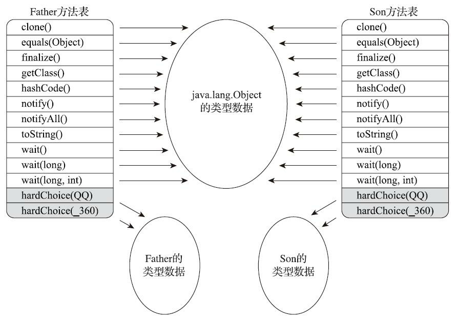

## 虚拟机字节码执行引擎

#### 1.概述

​	虚拟机是相对物理机的概念，物理机受制于处理器，缓存，指令集，操作系统的限制。而虚拟机则是由软件自行实现的，可以执行那些不被硬件直接支持的指令集格式。所有Java虚拟机的执行引擎输入输出都是一致的：输入字节码二进制
流，输出执行结果

#### 2.运行时栈帧结构

​	局部变量表，老朋友了，以一个变量槽为基础单位。操作数栈，动态连接，方法返回地址。
​	一个变量槽可以存放32位以内的数据类型：boolean，byte，int，char，short，float，reference，returnAddress（现在几乎已经不用了）。对于64位：long，double，高位对齐方式，分割为两个32位读写。
​	通过索引定位的方式使用局部变量表，访问的是32位数据类型变量，索引N代表使用第N个变量槽，64位的话会同时使用N，N+1。虚拟机不允许任何方式单独访问其中一个。当一个方法被调用时，Java虚拟机会使用局部变量表来完成参数值到参数变量列表的传递过程，~~即形参到实参。~~ 实参到形参。
​	需要注意的是局部变量表中的变量槽是可以重用的。
下面是我和chatGpt一段有趣的对话。

##### 您说：

我在研究java的局部变量表，下面是两段代码 使用verbose:gc可以看到他们的gc收集情况不同，详细解释一下

###### ChatGPT 说：

ChatGPT

记忆已更新

在这两段代码中，`byte[] placeholder` 的作用域不同，导致了两者在垃圾回收（GC）行为上的差异。

1. **第一段代码：**

   ```java
   java复制代码public static void main(String[] args) {
       byte[] placeholder = new byte[64 * 1024 * 1024];
       System.gc();
   }
   ```

   在这段代码中，`placeholder` 的作用域是整个 `main` 方法。在调用 `System.gc()` 时，`placeholder` 仍然在作用域内，即它仍然是一个可达的对象。虽然 `System.gc()` 会触发垃圾回收器尝试进行 GC，但因为 `placeholder` 仍在作用域内，垃圾回收器不会回收该对象，因此该对象仍然会占用内存。

2. **第二段代码：**

   ```java
   java复制代码public static void main(String[] args) {
       {
           byte[] placeholder = new byte[64 * 1024 * 1024];
       }
       int a = 0;
       System.gc();
   }
   ```

   在这段代码中，`placeholder` 的作用域仅限于大括号 `{}` 内。一旦执行完这段代码块，`placeholder` 的作用域结束，它就变成了不可达对象。在调用 `System.gc()` 时，虽然我们没有显式地将 `placeholder` 设为 `null`，但由于它已经超出了作用域，垃圾回收器会将其视为不可达对象并尝试回收它的内存。因此，这个对象有可能在 GC 时被回收。

**总结：**

- 第一段代码中，`placeholder` 在 GC 时仍然处于作用域内，无法被回收。
- 第二段代码中，`placeholder` 超出了作用域，GC 会将其标记为不可达，并有可能回收。

`verbose:gc` 的输出会反映这个差异：在第二段代码中，内存的释放和 GC 触发可能更加明显。

##### 您说：

不是这个原因，第二段代码如果不加int a=0，那么这两个的gc结果都是一样的。

###### ChatGPT 说：

ChatGPT

确实，`int a = 0;` 是影响垃圾回收行为的关键。Java 虚拟机在垃圾回收过程中，局部变量的作用范围和编译器优化都会对对象是否可达产生影响。

我们来更详细地分析为什么在第二段代码中加入 `int a = 0;` 会影响垃圾回收：

1. **代码执行时的局部变量表：** Java 的局部变量表用于保存方法中的局部变量。对于第一段代码，`placeholder` 在调用 `System.gc()` 时仍然占用着局部变量表中的一个槽位（slot）。即使它超出了局部作用域，只要编译器没有复用这个槽位，GC 仍然可能认为 `placeholder` 是可达的，因此不会回收它。
2. **第二段代码不带 `int a = 0;` 的情况：** 当不加 `int a = 0;` 时，`placeholder` 超出作用域后，局部变量表中的槽位仍然可能未被复用，因此在 GC 扫描时，`placeholder` 仍然被认为是可达的，导致这两个代码段的 GC 行为一致，内存不会被回收。
3. **加上 `int a = 0;` 的情况：** 当我们在第二段代码中加入 `int a = 0;` 时，局部变量表的槽位可能被复用，`a` 会占据原本属于 `placeholder` 的槽位。这意味着在调用 `System.gc()` 时，`placeholder` 的引用已经被覆盖，它不再是可达的对象，从而允许 GC 回收其占用的内存。

**解释：** 在 Java 中，局部变量的可达性不仅取决于其作用域，还取决于局部变量表的槽位是否被复用。如果某个变量仍然在局部变量表中占有一个槽位，即使它超出了作用域，GC 也可能不会回收它。如果该槽位被新的变量覆盖，则这个旧对象将被视为不可达，允许 GC 回收。

因此，`int a = 0;` 的存在导致了局部变量表中对 `placeholder` 的引用被清除，从而触发垃圾回收。

##### 您说：

在我没有告诉你int a=0这是一条关键代码之前，你是否知道后续的内容只是不想说出来，还是说你一开始只考虑到了作用域的条件

###### ChatGPT 说：

ChatGPT

在最初的回答中，我主要是基于变量的**作用域**来解释 GC 的行为，确实没有立即考虑到局部变量表的**槽位复用**这一点。这是因为变量作用域通常是影响可达性的重要因素之一，而槽位复用的影响往往不如作用域那么直观。

当你提到 `int a = 0;` 这个关键点后，我意识到应该进一步考虑局部变量表的槽位管理，以及 JVM 如何在垃圾回收时处理局部变量的引用问题。因此，后续的解释更多地涉及到了 JVM 局部变量表的机制。

简而言之，最初的回答是以作用域为主的解释，没有深入考虑到局部变量表槽位复用的情况。不过，当你指出了 `int a = 0;` 这条线索后，我才进一步拓展到这个更细节的方面。

哈哈哈，chatGpt真好玩~~~~

在研究时还发现了一个有意思的现象

```java
public static void main(String[] args) {
        for(int i=0;i<100;i++){
            {
                byte[] placeHolder=new byte[64*1024*1024];
            }
            int a=0;
            System.gc();
        }
    }
```

局部变量槽的复用还会影响JVM对于堆内存的大小分配，在没有int a=0；时，G1给分配的内存时256MB
[0.802s][info][gc] GC(294) Pause Full (System.gc()) 136M->68M(256M)
当加入这条语句时
[0.873s][info][gc] GC(293) Pause Full (System.gc()) 68M->0M(16M)
它被优化成了16MV

##### 引用作者周志明的话——这些代码除了做实验外没有任何意义

#### 3.操作数栈

这不用多解释吧，只要是大学里学过数据结构的都清除。。介绍点大家不知道的
理论上来将栈帧都是应该相互隔离的吧，但是虚拟机会对其做出优化。


#### 4.动态连接

​	栈帧中保存的引用地址指向常量池中该栈帧所属的方法引用，是为了支持方法调用过程中的动态连接。我们知道在Class文件的常量池中保存有大量符号引用，一部分会在类加载或第一次使用时直接转化位直接引用——被称为静态引用。另一部分将在每一次运行期间都转化为动态引用——动态连接

#### 5.解析

​	Java虚拟机对于在编译期已确定的方法的调用称为解析。——静态方法，私有方法，实例构造器，父类方法，final修饰的方法等被称为非虚方法。
​	Java虚拟机支持5中方法调用字节码指令
​	•invokestatic		 调用静态方法
​	•invokespecial	      调用实例构造器<init>，私有和父类方法
​	•invokevirtual	        调用所有的虚方法
​	•invokeinterface	    调用接口方法，在运行时再确定一个实现该接口的对象
​	•invokedynamic	     动态解析出方法，与前四个不同的是它的逻辑由用户主导。而上面的逻辑是固化在Java虚拟机内部。

#### 6.分派

​	分派分为静态分派和动态分派两种

##### 一：静态分派

​	在java中最典型的就是方法重载

```java
public class StaticDispatch {
    static abstract class Human {
    } 
    static class Man extends Human {
    } 
    static class Woman extends Human {
    } 
    public void sayHello(Human guy) {
        System.out.println("hello,guy!");
    } 
    public void sayHello(Man guy) {
        System.out.println("hello,gentleman!");
    } 
    public void sayHello(Woman guy) {
        System.out.println("hello,lady!");
    } 
    public static void main(String[] args) {
        Human man = new Man();
        Human woman = new Woman();
        StaticDispatch sr = new StaticDispatch();
        sr.sayHello(man);
        sr.sayHello(woman);
    }}
```

因为Javac编译器在编译阶段就通过静态类型Human确定了方法的传入参数类型（后面的Man被称为实际类型），所以下面的结果输出为

hello,guy!
hello,guy!

```java
你可以将代码改为
sr.sayHello((Man) man);			sr.sayHello((Woman) woman);
```

但这也是编译器能够预先知道参数类型而确定重载使用的是那个方法

##### 二：动态分派

​	以重写为例子

```java
public class DynamicDispatch {
    static abstract class Human {
        protected abstract void sayHello();
    } 
    static class Man extends Human {
        @Override
        protected void sayHello() {
            System.out.println("man say hello");
        }
    }
    static class Woman extends Human {
        @Override
        protected void sayHello() {
            System.out.println("woman say hello");
        }
    } 
    public static void main(String[] args) {
        Human man = new Man();
        Human woman = new Woman();
        man.sayHello();
        woman.sayHello();
        man = new Woman();
        man.sayHello();
    }}
```

使用javap -v生成字节码文件

```tex
 public static void main(java.lang.String[]);
    descriptor: ([Ljava/lang/String;)V
    flags: (0x0009) ACC_PUBLIC, ACC_STATIC
    Code:
      stack=2, locals=3, args_size=1
         0: new           #7                  // class com/lordyi/classloading/DynamicDispatch$Man
         3: dup
         4: invokespecial #9                  // Method com/lordyi/classloading/DynamicDispatch$Man."<init>":()V
         7: astore_1
         8: new           #10                 // class com/lordyi/classloading/DynamicDispatch$Woman
        11: dup
        12: invokespecial #12                 // Method com/lordyi/classloading/DynamicDispatch$Woman."<init>":()V
        15: astore_2
        16: aload_1
        17: invokevirtual #13                 // Method com/lordyi/classloading/DynamicDispatch$Human.sayHello:()V
        20: aload_2
        21: invokevirtual #13                 // Method com/lordyi/classloading/DynamicDispatch$Human.sayHello:()V
        24: new           #10                 // class com/lordyi/classloading/DynamicDispatch$Woman
        27: dup
        28: invokespecial #12                 // Method com/lordyi/classloading/DynamicDispatch$Woman."<init>":()V
        31: astore_1
        32: aload_1
        33: invokevirtual #13                 // Method com/lordyi/classloading/DynamicDispatch$Human.sayHello:()V
        36: return
```

​	在0-16步都是在准备，将两个对象引用放入栈顶，可以看到在1和21步中的invokevirtual都是Human.syaHello:()，既然符号引用都是一样的，但是最终的结果不一样，说明问题出在invokevirtual上

​	invokevirtual指令运行时解析大致分为4步

##### 	1）找到操作数栈顶的第一个元素所指向的对象的实际类型，记为C

##### 	2）如果在C中找到了与常量中描述符和简单名称都相符的方法，则进行权限校验，通过则返回次方法的直接引用，查找过程结束。不通过则抛出异常java.lang.illegalAccessError

##### 	3)否则，按照继承关系从下至上依次查找C的各个父类进行第二部

##### 	4）始终没有，则抛出异常java.lang.AbstractMethodError

要注意的是只有方法存在多态性，字段没有

```java
public class FieldHasNoPolymorphic {
    static class Father {
        public int money = 1;

        public Father() {
            money = 2;
            showMeTheMoney();
        }

        public void showMeTheMoney() {
            System.out.println("I am Father, i have $" + money);
        }
    }

    static class Son extends Father {
        public int money = 3;

        public Son() {
            money = 4;
            showMeTheMoney();
        }

        public void showMeTheMoney() {
            System.out.println("I am Son, i have $" + money);
        }
    }

    public static void main(String[] args) {
        Father gay = new Son();
        System.out.println("This gay has $" + gay.money);
    }
}
```

```
结果是
I am Son, i have $0
I am Son, i have $4
This gay has $2
```

​	首先是在子类被构造器会先调用父类构造器，执行money=2改变的是父类中的money而不是son中的，因为字段的绑定是静态的，和多态无关。执行父类的showMeTheMoney时，调用的是Son::showMeTheMoney（），此时son中的money还没有被赋值，所以是0.

照例晒出字节码

```tex
Code:
      stack=2, locals=2, args_size=1
         0: new           #7                  // class com/lordyi/classloading/FieldHasNoPolymorphic$Son
         3: dup
         4: invokespecial #9                  // Method com/lordyi/classloading/FieldHasNoPolymorphic$Son."<init>":()V
         7: astore_1
         8: getstatic     #10                 // Field java/lang/System.out:Ljava/io/PrintStream;
        11: aload_1
        12: getfield      #16                 // Field com/lordyi/classloading/FieldHasNoPolymorphic$Father.money:I
        15: invokedynamic #22,  0             // InvokeDynamic #0:makeConcatWithConstants:(I)Ljava/lang/String;
        20: invokevirtual #26                 // Method java/io/PrintStream.println:(Ljava/lang/String;)V
        23: return
```

​	可以看到调用了invokespecial指令，调用方法<init>。意外之喜的后面这个invokedynamic，我一开始还没反应过来，因为背八股文的时候都是说Java字符串拼接是使用StringBuilder，而我这里使用的Java17明显不是这样的。它使用了java.lang.invoke.StringConcatFactory来做字符串拼接，比传统的StringBuilder更高效。而主要的优化就是它能直接使用invokedynamic指令做了内联优化。

#### 7.虚拟机动态分派的实现

​	书中说的是通过在方法区建立一个虚方法表和接口方法表，存放着各个方法的实际入口地址。到了实际现在的Java23版本，多出来了很多其他的优化方法如内联缓存，分派向量，逃逸分析，JIT 编译与方法内联，直接字节码到机器码生成等。



Son重写
了来自Father的全部方法， 因此Son的方法表没有指向Father类型数据的箭头。 但是Son和Father都没有
重写来自Object的方法， 所以它们的方法表中所有从Object继承来的方法都指向了Object的数据类型。  